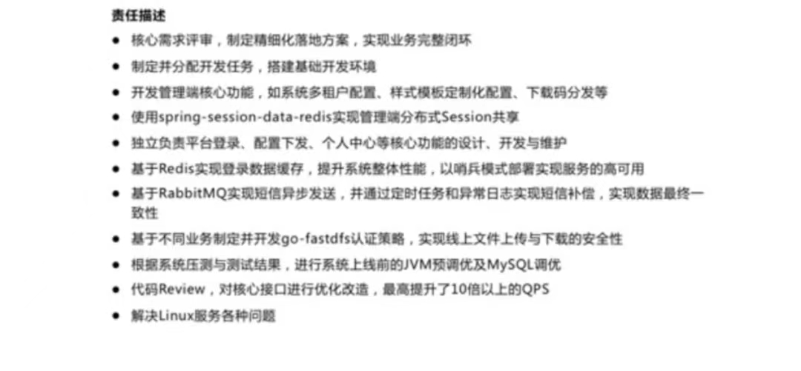

##  平常心是前提

- 心态放平，踏实储备技术,遇到问题，发现问题，解决问题。 不要看轻或太看重自己。
- 如果静不下心来，去跑步，去发泄，缓解压力，然后再来学习。

---

##  个人简历如何写

- 1. 简历模板
- 2. 个人情况：姓名，性别，年龄，工作经验，邮箱，联系方式，籍贯
- 3. 技能描述：不是个人优势，详细的展示每一个技术栈，不要只写技术名词，要展示技术优势和细节，`引导面试官问你准备好的问题`。（精通，熟悉，不要写了解）
    - 精通，熟悉Java核心技术，多年一线开发经验，具备良好的编程能力，并熟练应用`设计模式`。
    - 精通，熟悉JVM，对类加载机制，GC算法，垃圾回收器等都有深入理解，并参与过线上项目的`JVM调优`工作。（结合真实的项目）
    - 精通，熟悉并发编程（JUC），对Java中的各种锁，线程池机制，AQS(换技能，比如CAS，ThreadLocal)等都有深入理解，并在项目中熟练使用。 （足够熟悉的点，写上去），不会的就说不会。
    - 精通，熟悉Spring，SpringMVC，SPringBoot，MyBatis等核心框架，可以根据需求快速搭建项目，并且`阅读过核心源码`。  (引导面试问核心源码)(并深入理解SpringBoot源码的启动流程，SpringBoot自动装配原理，IOC底层实现机制)
    - 精通，熟悉SpringCloud,SpringCloud Alibaba,Dubbo等微服务框架，对Nacos，Sentinel等组件有深入理解，`并参与过项目中的服务划分，服务治理，服务分层`。对SpringCloud相关源码也有深入理解。 
    - tips========: `八股文内容之上，结合进项目中如何使用，如何解决问题`。
    - 精通，熟悉常用的分布式解决方案：分布式事务，分布式锁，分布式ID，分布式幂等等。 分布式任务调度,分布式链路追踪(掌握了就写)
    - 精通,熟悉MySQL，对MySQL的索引，事务，锁，存储引擎都有深入理解，并`参与过项目中的SQL优化工作`。
    - 精通,熟悉Redis，对底层刷盘和IO模型，持久化机制都有深入理解，对于单机Redis和集群Redis都有实际的项目经验。
    - 精通，熟悉Kafka，对底层刷盘机制(零拷贝，顺序读写)，集群分片机制都有深入理解，并对消息丢失和重复消费有对应的解决方案，同时熟悉RocketMQ，RabbitMQ等其他中间件。（中间件技术选型，优劣）
    - tips========: `结合自己的技术储备,不一定都要写`
    - Nginx，LVS，LUA
    - Docker K8S
    - ElasticSearch
    - Mongodb
    - Netty
    - Http,Https,网络
    - MyCat，ShardingSphere
    - ==========有时间就要补的计算机基础===============
    - 算法
    - 计算机组成原理
    - 计算机网络
    - 操作系统
- 4. 项目经历（三到四个项目，展示出价值和优势）
    - 项目名称，不要出现系统，写xx平台，项目名称体现项目内容
    - 项目描述: 不要堆积文字，三四行描述项目价值（项目解决什么问题，提供什么行业解决方案，包含哪些核心内容），展示数据量（数据库存储数据量，多少人多少企业在用，日活，tps，qps）
    - 技术架构：罗列技术站有哪些 + 号连接
    - 职责描述：突出你对项目的贡献（最好显示出缺你不可），分条展示，虚实结合 ，虚（需求分析，数据库设计，项目进度把控，代码review）/ 实 （实际业务点细节，比如利用什么技术完成什么功能，遇到什么问题，如何解决的）；适当增加业务需求点，自圆其说，重点展示自己解决问题的能力
    - 
    - 难点亮点：不写，准备好几个点面试用，从这几个方向思考： 调优，重构，架构设计。
- 5. 工作经历： 公司名称，时间，职位即可;不要出现不满一年工作。
- 6. 教育背景：学校，学历，专业
- 7. 个人评价：重点展示行业背景和技术经验，从业务背景，技术深度，解决方案等多个纬度写，比如做过什么行业项目，提出过什么技术解决方案，接触过多大数据量项目，做过哪些架构设计，对哪些技术有深入理解和沉淀。 

## 面试表达

### 自我介绍

- 1. 个人情况：姓名，年龄，学校专业，籍贯。
- 2. 从业经历：每一份工作公司名称和项目做简单描述。
- 3. 技术储备：展示你所具备的技术栈和技术体系
- 4. 最近或者最熟悉，最有得聊的一个项目：`介绍项目的价值所在，包含了哪些功能，你在其中承担什么样的角色，做过哪些具体的业务西街店，自己遇到最大的问题是什么以及如何解决的。`
- 5. 对于即将面试公司的背调：作为自我介绍的收尾，把话题抛给面试官。

### 介绍项目

- 1. 项目内容（解决什么问题，核心的业务点或者模块做一个描述）。
- 2. 项目架构：`可以带笔和纸画下来描述清楚，边画边解释，引导面试官`。
- 3. 自己在项目中的职责（具体业务点的实践）；
- 4. 项目中遇到的最大问题是啥，你是如何解决的。（展示解决问题的能力）
- 5. 项目的总结，话题交给面试官。

> 先打草稿，写出来演练。

